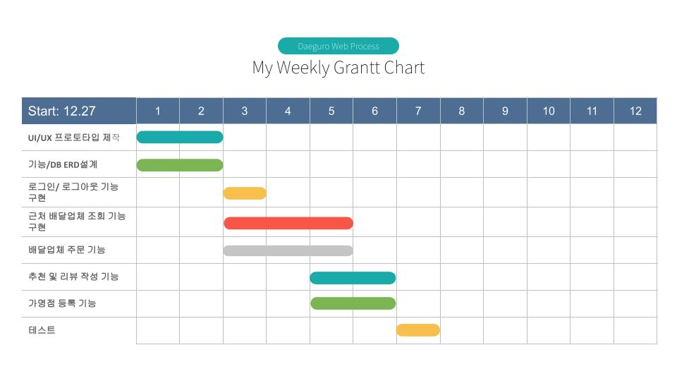

## 배달앱[대구로]: 웹 개발 Clone 프로젝트

# OverView 
  1. 아케텍처(추가예정)
  2. <a href = "https://docs.google.com/spreadsheets/d/1dwUyUC8X01WGSuRdHDlRUA3yHVH9tlbpUCRwhLNwGdM/edit?usp=sharing">도메인 사전</a>
  3. <a href = "https://docs.google.com/spreadsheets/d/1dwUyUC8X01WGSuRdHDlRUA3yHVH9tlbpUCRwhLNwGdM/edit#gid=2124564765?usp=sharing">메시지 정의서</a>
# Skill Stack
  + FrontEnd
    + React JS
    + TypeScript
  + BackEnd
    + JavaSpring
    + PostgreSQL
    + Redis
    + Docker
# LoadMap

# DB(v0.0.1) 구조

